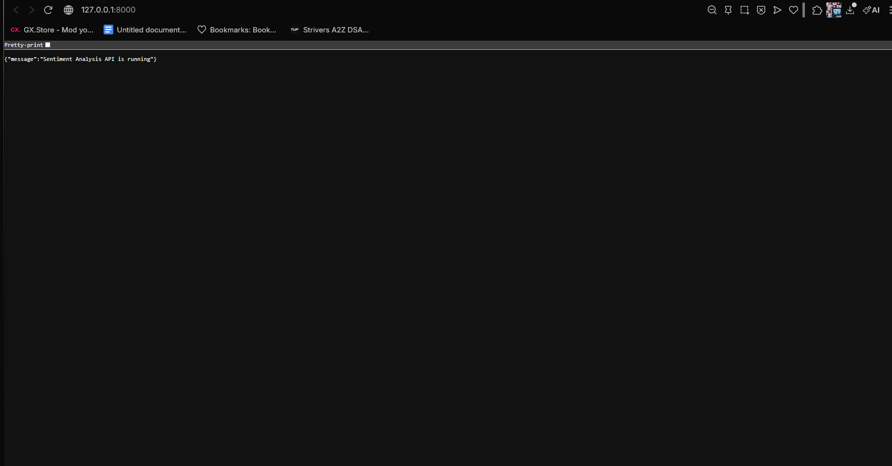
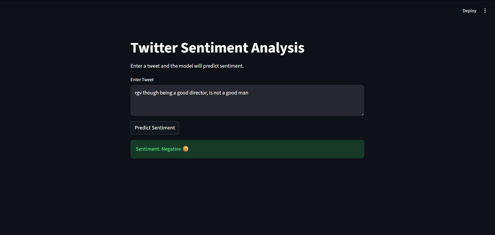

<h1 align="center">Twitter Sentiment Analysis System</h1>

<p align="center">
Transformer-Powered NLP Application for Real-Time Tweet Sentiment Prediction
</p>

<p align="center">
<a href="#technologies">Technologies</a> •
<a href="#features">Features</a> •
<a href="#architecture">Architecture</a> •
<a href="#screenshots">Screenshots</a> •
<a href="#installation">Installation</a> •
<a href="#usage">Usage</a> •
<a href="#api">API</a>
</p>

<p align="center">


</p>

---

# Technologies

### Machine Learning
- PyTorch
- HuggingFace Transformers
- BERT Transformer Model

### Data Processing
- Pandas
- NumPy
- Scikit-learn

### Backend
- FastAPI
- Uvicorn

### Frontend
- Streamlit

---

# Features

### Real-Time Tweet Sentiment Prediction
Predicts tweet sentiment instantly using trained NLP models.

### Transformer-Based NLP Model
Uses **BERT** for high-accuracy sentiment classification.

### REST API
FastAPI backend provides scalable model inference.

### Interactive Web UI
Streamlit interface allows quick testing of predictions.

### Multiple Models Implemented

The project includes:

• Baseline ML Model  
• LSTM Deep Learning Model  
• BERT Transformer Model  

This enables comparison between classical ML approaches and modern transformer architectures.

---

# Architecture


User Input (Tweet)
↓
Streamlit UI / FastAPI API
↓
Text Preprocessing
↓
BERT Tokenizer
↓
Transformer Model
↓
Sentiment Prediction


---

# Screenshots

## FastAPI API Documentation



---

## Streamlit Web Interface



---

# Installation

Clone the repository

```bash
git clone https://github.com/geetharaj47/twitter-sentiment-analysis-system.git
cd twitter-sentiment-analysis-system

Install dependencies

pip install -r requirements.txt
Usage
Run the FastAPI Backend
uvicorn src.api.app:app --reload

Open API documentation:

http://127.0.0.1:8000/docs
Run the Streamlit Web Interface
streamlit run src/ui/streamlit_app.py
API
Endpoint
POST /predict
Request Example
{
"text": "This movie was amazing!"
}
Response Example
{
"tweet": "This movie was amazing!",
"sentiment": "Positive 😀"
}
Project Structure
twitter-sentiment-analysis-system
│
├── assets
│   ├── api_docs.png
│   └── streamlit_ui.png
│
├── data
│   ├── raw
│   └── processed
│
├── notebooks
│   └── eda.ipynb
│
├── results
│
├── src
│
│   ├── api
│   │   └── app.py
│
│   ├── data
│   │   └── preprocess_data.py
│
│   ├── models
│   │   ├── baseline_model.py
│   │   ├── lstm_model.py
│   │   └── bert_sentiment_model
│
│   ├── training
│   │   └── train_lstm.py
│
│   ├── transformer
│   │   ├── train_bert.py
│   │   └── predict_bert.py
│
│   └── ui
│       └── streamlit_app.py
│
├── requirements.txt
└── README.md
Author

Geetharaj

Machine Learning & Data Engineering Enthusiast

GitHub
https://github.com/geetharaj47